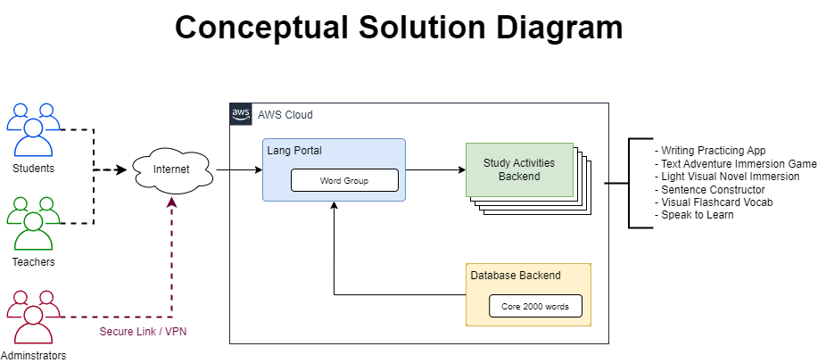
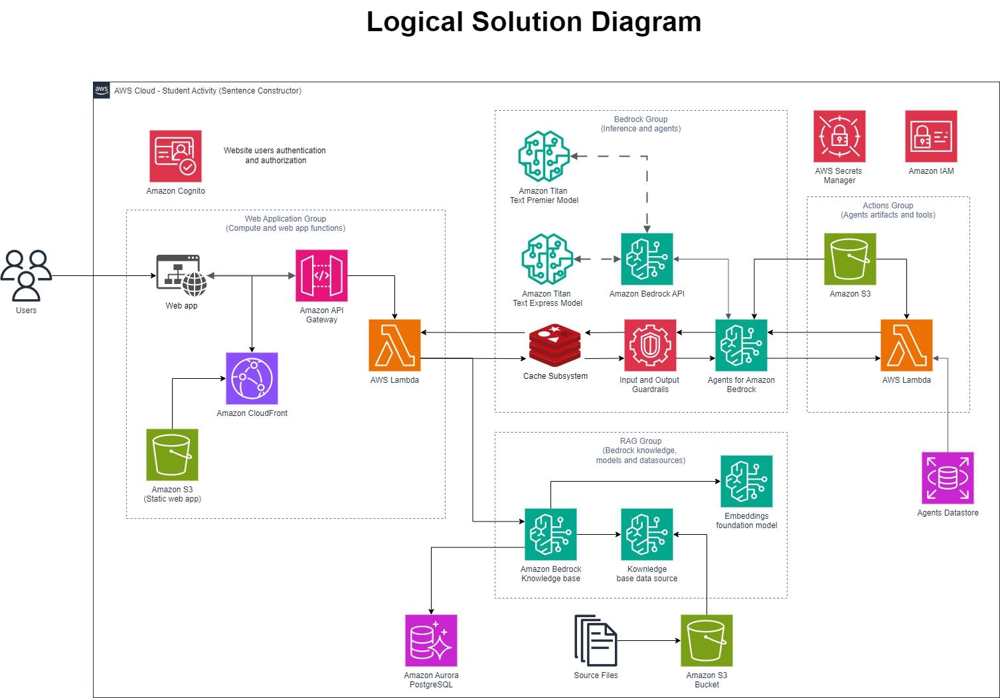

# Business Scenario

The objective for this project consists in the development of an AI Language Assistant that aims to extend the language offering and also augment the learning experience for students between instructor-led classes in a fictitious school website for the purpose of participating in the ExamPro GenAI Bootcamp 2025.

This project has the following main objectives:
- Build a collection of learning apps using various different use-cases of AI
- Maintain the learning experience the learning portal using AI developer tools
- Extend the platform to support various different languages

 

> **Note**: During the course of the bootcamp, this documentation will be updated in order to reflect any changes or modifications to the project scope and technical requirements to be implemented.

## Conceptual and Logical Diagrams

> **TODO**: finish intro text

> **TODO**: finish intro text

## Requirements

### Functional Requirements

The sponsor of the project wants to develop a solution that requires the minimum upfront investment in infrastructure without disregarding data protection considerations.

The users will access the system through a web site that will guide them to the different sections and funcionalities.

There will be available an low-cost AI Platform for local development and tests of the application. The PoC will be tested in the sponsor institution using a medium sized group of students and teachers using the local infrastructure for the local deployment.

### Non-functional Requirements

The non-function requirements will mostly depend on the choices made during the planing and design phase, but shoul account for a capable training and inference local infrastructure for tests capable of handling the group of models selected for usage.

> **TODO**: Complete section documentation.

### Risks

The main risks are related with the lack of available data sources for the national languages that we want to use in this solution. 

### Assumptions

There will be an easy access to Open-Source LLMs capable of fine-tuning and RAG implementation on local development systems without the need of importing equipement to the country.

The users will be using the application on a free tier for most of the funcionalities, offering a paid subscription for intensive AI usage.

The education institution will prepare and curate the training dataset for the national languages that will be included in order to be able to fine-tune the models.

All data storage and usage must abide by the national data protection laws applicable to Angola.

## Constraints

We realise the complexity and costs associated with fine-tuning or re-training LLMs models, so the development team must be able to accomplish those tasks with the miminum overhead cost in order to maintain the pricing of the solution affordable to potencial customers and users.

Another main constraint is related with the availability and quality of the training data, which may require to phase out the deployment offer and even limit the number of national languages to be included in the initial release.

## Data Strategy

All reference materials, documentation and info used for and by the system must be validated for compliance and the legal department of the sponsor institution must approve the usage of any data to be used.

There are legal national constraints on the storage and usaged of personal and identifiable data that must be addressed and governance must be implemented before and during the development and deployment of the solution.

All data in the system must be protected by in-rest and in-transit encryptation with the appropriate security mechanisms and any PII must be removed before upload of any document or text. 

## Model Selection and Development

The LLMs models that will be used are dependent of the following factors:
- Must be Open-source and RAG enabled;
- Should be able to translate and use the Portuguese Language;
- They must have a token size capable of dealing with context that will be supplied and any response cut-off should be minimum;
- Must have model cards and explainability well documented
 
## Infrastructure Design

The infrastructure for the development and deployment of the solution will be distributed between external and national cloud providers with some services maintained in-permises.

Some investment in low-cost training GPUs can be made in order to support and incentivise continuous local development and upgrades.

## Integration and Deployment

> **TODO**: create section documentation.

## Monitoring and Optimization

> **TODO**: create section documentation.

### Governance and Security

Implement strong governance and security measures:
Develop policies for responsible AI use
Implement access controls and data protection measures
Ensure compliance with relevant regulations and industry standards
Scalability and Future-Proofing
Design the architecture with scalability and future advancements in mind:
Use containerization and microservices for flexibility
Implement version control for models and data
Plan for potential increases in computational requirements
