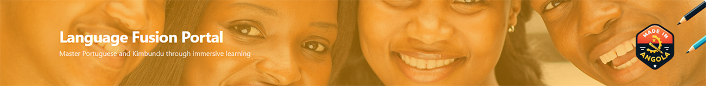
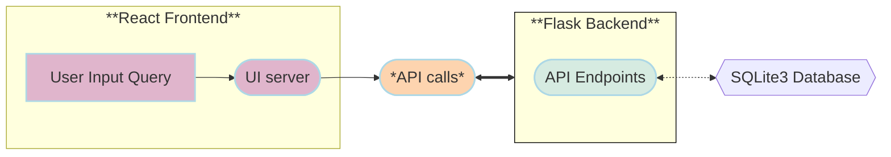
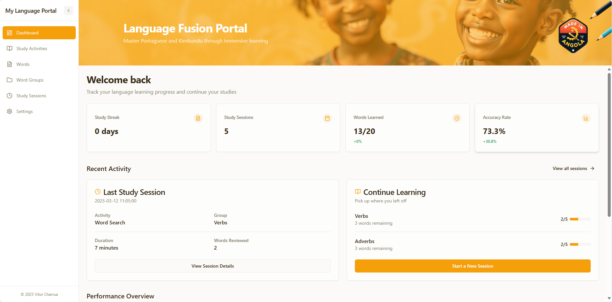
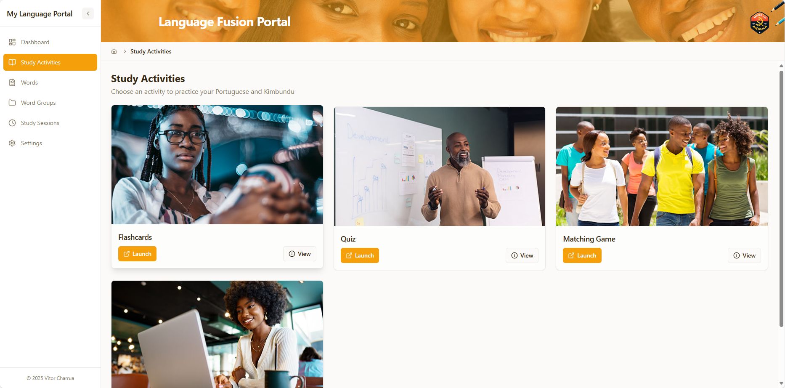
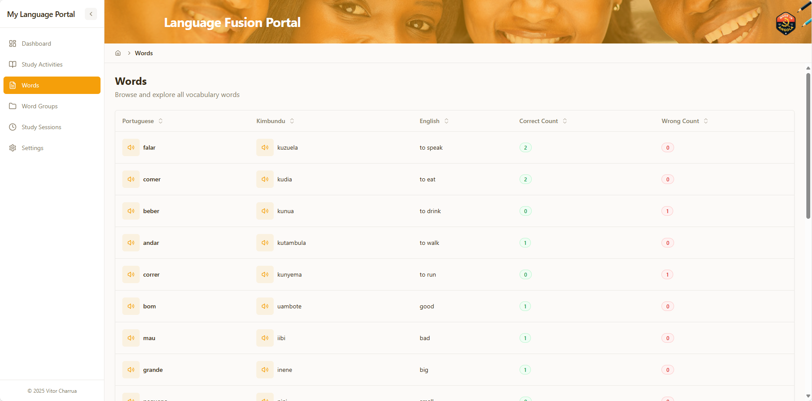
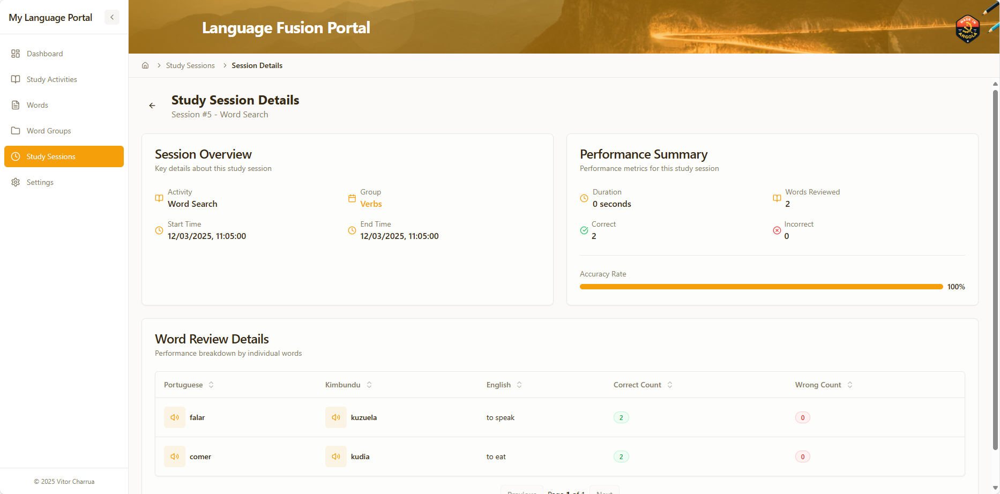

# Language Portal



A comprehensive language learning platform for Portuguese and Kimbundu vocabulary acquisition.

## Overview

Lang-Portal serves as a central hub for language learning with three main purposes:

- **Vocabulary Repository**: A comprehensive inventory of words to learn, organized by thematic groups
- **Learning Record Store (LRS)**: Track learning progress with correct and wrong scores for practiced vocabulary
- **Unified Launchpad**: A single access point for various language learning applications and activities

## System Architecture

Lang-Portal is built using a modern tech stack with a Flask backend and React frontend:



## Features

### Dashboard
- Learning progress summary
- Quick statistics (success rate, study sessions, active groups)
- Recent study activity overview
- Performance graphs showing vocabulary mastery over time
- Continue learning section for incomplete sessions



### Study Activities
- Launch various learning applications
- Track study sessions by activity type
- Review past performance by activity
- Select word groups for targeted practice



### Vocabulary Management
- Browse complete word inventory
- View words by thematic groups
- Check individual word details and learning statistics
- Audio playback for pronunciation practice



### Learning Analytics
- Session-by-session performance tracking
- Word mastery statistics
- Group progress visualization
- Learning trends over time




More images [here](./ui-images/).

## Installation and Setup

### Prerequisites
- Python 3.8+ for the backend
- Node.js 16+ for the frontend
- SQLite3

### Backend Setup

```bash
# Navigate to backend directory
cd backend-flask

# Create and activate virtual environment
python -m venv venv
source venv/bin/activate  # On Windows, use: venv\Scripts\activate

# Install dependencies
pip install -r requirements.txt

# Initialize database
invoke init-db
invoke migrate
invoke seed

# Start the backend server
python run.py
```

The backend server will start on http://localhost:5000

### Frontend Setup

```bash
# Navigate to frontend directory
cd frontend-react

# Install dependencies
npm install

# Start development server
npm run dev
```

The frontend development server will start on http://localhost:5173

## Usage Guide

### Getting Started
1. Access the dashboard to view your learning progress
2. Browse available vocabulary by words or groups
3. Launch study activities to practice vocabulary
4. Track your performance through learning analytics

### Study Workflow
1. Select a study activity from the activities page
2. Choose a word group to practice
3. Complete the learning exercise
4. Review your performance on the dashboard

### Managing Progress
- Reset learning history if you want to start fresh
- Use the settings page for system preferences
- View detailed word statistics to identify areas needing improvement

## Development

### Tech Stack
- **Backend**: Flask, SQLite3, Flask-cors, Invoke
- **Frontend**: React, TypeScript, Tailwind CSS, ShadCN UI components, Vite.js

### Project Structure
```
lang-portal/
├── backend-flask/      # Flask API backend
│   ├── app/            # API routes and models
│   ├── lib/            # Database utilities
│   ├── migrations/     # Database migrations
│   └── seeds/          # Seed data
│
└── frontend/           # React frontend
    ├── src/
    │   ├── components/ # Reusable UI components
    │   ├── hooks/      # Custom React hooks
    │   ├── pages/      # Page components
    │   └── services/   # API services
    └── public/         # Static assets
```

### Environment Configuration
- Backend: Configuration in `config.py`
- Frontend: Environment variables in `.env` file


## Deployment with Docker Compose

In order to deploy the application using Docker, you can user the `docker-compose.yml` file in the `deployment/docker_compose` directory.

### Deployment with image build

To be used for the first time deployment with image build for the `backend-flask` and `frontend-react` services:

```	bash
cd deployment/docker_compose
docker compose up --build -d
```

### Deployment without image build

```	bash
cd deployment/docker_compose
docker compose up -d
```


## Future Improvements

- User authentication and personalized learning paths
- Additional language support
- Mobile application
- Offline learning mode
- Social features for collaborative learning
- Integration with more third-party learning applications

## Contributing

Contributions are welcome! Please feel free to submit a Pull Request.

1. Fork the repository
2. Create your feature branch (`git checkout -b feature/amazing-feature`)
3. Commit your changes (`git commit -m 'Add some amazing feature'`)
4. Push to the branch (`git push origin feature/amazing-feature`)
5. Open a Pull Request