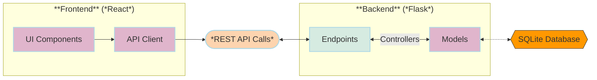

# Language Learning Portal - Frontend Application

This frontend application serves as the user interface for a language learning portal focused on Portuguese, Kimbundu, and English vocabulary. It provides an interactive experience for exploring vocabulary words, managing thematic groups, tracking study sessions, and engaging with learning activities.

## Objectives

- Provide a responsive and intuitive interface for users to explore vocabulary words
- Offer multiple study activities for language learning
- Track and display learning progress through comprehensive dashboards
- Deliver a seamless, accessible user experience across devices

## Tech Stack

- **React.js**: JavaScript library for building user interfaces
- **TypeScript**: Static typing for JavaScript
- **Tailwind CSS**: Utility-first CSS framework for styling
- **Vite.js**: Build tool and development server
- **ShadCN**: Component library for consistent UI elements
- **React Router**: Client-side routing

## File Structure

```
frontend-react/
├── public/                         # Static assets
├── src/                            # Application source code
│   ├── assets/                     # Images, fonts, etc.
│   ├── components/                 # Reusable UI components
│   │   ├── layout/                 # Layout components
│   │   ├── dashboard/              # Dashboard-specific components
│   │   ├── study-activities/       # Study activity components
│   │   ├── words/                  # Word-related components
│   │   └── ui/                     # General UI components
│   ├── config/                     # Configuration files
│   │   └── api.ts                  # API configuration
│   ├── hooks/                      # Custom React hooks
│   │   ├── dashboard/              # Dashboard-related hooks
│   │   ├── study_activities/       # Study activity hooks
│   │   ├── words/                  # Word-related hooks
│   │   ├── groups/                 # Group-related hooks
│   │   └── study_sessions/         # Study session hooks
│   ├── pages/                      # Page components
│   │   ├── Dashboard.tsx           # Dashboard page
│   │   ├── StudyActivities/        # Study activity pages
│   │   ├── Words/                  # Word-related pages
│   │   ├── Groups/                 # Group-related pages
│   │   ├── StudySessions/          # Study session pages
│   │   └── Settings.tsx            # Settings page
│   ├── services/                   # API service functions
│   │   ├── api.service.ts          # Base API service
│   │   ├── dashboard.service.ts    # Dashboard API service
│   │   ├── study_activities.service.ts # Study activities API service
│   │   ├── words.service.ts        # Words API service
│   │   ├── groups.service.ts       # Groups API service
│   │   └── study_sessions.service.ts # Study sessions API service
│   ├── types/                      # TypeScript type definitions
│   ├── utils/                      # Utility functions
│   ├── App.tsx                     # Main application component
│   ├── main.tsx                    # Application entry point
│   └── routes.tsx                  # Route definitions
├── .env                            # Environment variables
├── index.html                      # HTML entry point
├── package.json                    # Project dependencies
├── tsconfig.json                   # TypeScript configuration
├── vite.config.ts                  # Vite configuration
└── tailwind.config.js              # Tailwind CSS configuration
```

## Application Routes

The frontend application includes the following routes, each serving a specific purpose in the language learning experience:

- `/dashboard` - Landing page with learning progress overview
- `/settings` - Application settings and data management
- `/study_activities` - Browse available learning activities
- `/study_activities/:id` - View details of a specific learning activity
- `/study_activities/:id/launch` - Launch an activity with a selected word group
- `/words` - Browse vocabulary words with filtering and sorting
- `/words/:id` - View details of a specific vocabulary word
- `/groups` - Browse thematic word groups
- `/groups/:id` - View details of a specific word group
- `/study_sessions` - Browse history of study sessions
- `/study_sessions/:id` - View details of a specific study session

## Global Components

### Navigation

The application features a collapsible vertical navigation bar with links to all main sections:
- Dashboard
- Study Activities
- Words
- Word Groups
- Study Sessions
- Settings

### Banner

A banner component appears at the top of each page, with an enhanced version on the dashboard.

### Breadcrumb

A breadcrumb trail helps users understand their location in the application hierarchy.

## Page Descriptions

### Dashboard

The dashboard provides a comprehensive overview of learning progress:
- Last study session summary (activity, time, performance)
- Study progress statistics (words learned, mastery percentage)
- Quick stats (success rate, study sessions, active groups, streak)
- Continue learning section with recent incomplete sessions
- Performance graph showing vocabulary progress over time

### Study Activities

Browse available learning activities displayed as cards with:
- Thumbnails
- Titles
- Launch and View buttons
- Option to start a new study session by selecting a word group

### Words

Explore vocabulary words with:
- Sortable table columns
- Pagination
- Audio pronunciation
- Performance statistics for each word
- Detailed view of individual words with group associations

### Word Groups

Browse thematic word groups with:
- Group statistics
- Associated words
- Study sessions for each group
- Tabbed interface for words and sessions

### Study Sessions

Track learning history with:
- Session details (activity, group, time)
- Performance metrics (correct vs. incorrect responses)
- Words reviewed in each session

### Settings

Configure application settings including:
- Reset history option
- Full database reset option
- Dark/light mode toggle

## API Integration

### Architecture

The frontend connects to the Flask backend through a structured service layer:



### Configuration

The API base URL is configured in `src/config/api.ts` with a default of `http://localhost:5000`, which can be overridden using environment variables.

### Custom Hooks

Custom hooks handle data fetching, state management, and business logic, separating these concerns from UI components. Each feature area has dedicated hooks that build upon service functions.

### Services

Service functions make API calls to backend endpoints. Each feature area has a dedicated service file with functions that correspond to specific API endpoints.

## Setup and Deployment

### Prerequisites

- Node.js 20.x
- npm or yarn package manager
- Docker (optional, for containerized deployment)

### Installation

#### 1. Clone the repository:
```bash
git clone <repository-url>
cd lang-portal/frontend-react
```

#### 2. Install dependencies:
```bash
npm install
# or
yarn   
```

#### 3. Create a .env file:
```bash	
VITE_API_BASE_URL=http://localhost:5000
``` 

#### 4. Start the development server:
```bash
npm run dev
# or
yarn dev
```

The application will be available at http://localhost:5173.

### Docker Deployment

You can also deploy the application using Docker:

#### 1. Build the Docker image:

```bash
# Set the root directory of the OPEA Comps repository
export FRONTEND_FOLDER="/path-to-free-genai-bootcamp-2025/lang-portal/frontend-react"
cd ${FRONTEND_FOLDER}

# Build the container
docker build \
  -t genai-bootcamp-2025/language-portal-frontend:latest \
  -f docker/Dockerfile .


docker build \
  -t genai-bootcamp-2025/language-portal-frontend:latest \
  -f Dockerfile .
```

#### 2. Run the Docker container:

```bash
docker run -p 5173:5173 genai-bootcamp-2025/language-portal-frontend:latest
```

This will build and start the container with the React application running on port 5173.

For production deployment with custom API URL:
```bash
docker run -p 5173:5173 -e VITE_API_BASE_URL=http://api-server-url genai-bootcamp-2025/language-portal-frontend:latest
```

### Production Build

To create a production build:

```bash
npm run build
# or
yarn build
```

The build output will be in the `dist` directory, which can be served by any static file server.

## Development Workflow

1. **Component Development**: 
   - Create or modify components in the `src/components` directory
   - Use Storybook (if available) for isolated component development

2. **Page Development**:
   - Create or modify page components in the `src/pages` directory
   - Use custom hooks for data fetching and state management

3. **API Integration**:
   - Add or update service functions in the `src/services` directory
   - Create custom hooks that use these services

4. **Styling**:
   - Use Tailwind CSS utility classes for styling
   - For complex components, consider extracting styles to separate files

5. **Testing**:
   - Write unit tests for components and hooks
   - Test API integration with mock services

## Error Handling

The application includes comprehensive error handling at multiple levels:

1. **API Service Level**: HTTP errors and response parsing
2. **Hook Level**: Error state management
3. **Component Level**: User-friendly error messages and fallbacks

## Pagination and Sorting

List views use a standardized pagination and sorting system that provides:
- Page navigation
- Items per page selection
- Column sorting (ascending/descending)
- Consistent UI across all list pages

## Theming and Accessibility

The application supports:
- Light and dark mode themes
- Keyboard navigation
- Screen reader compatibility
- Responsive design for mobile and desktop

## Future Improvements

- Add comprehensive test coverage
- Implement offline support with service workers
- Add user authentication and profiles
- Support for additional languages
- Performance optimizations for large vocabulary sets
- Advanced analytics for learning patterns