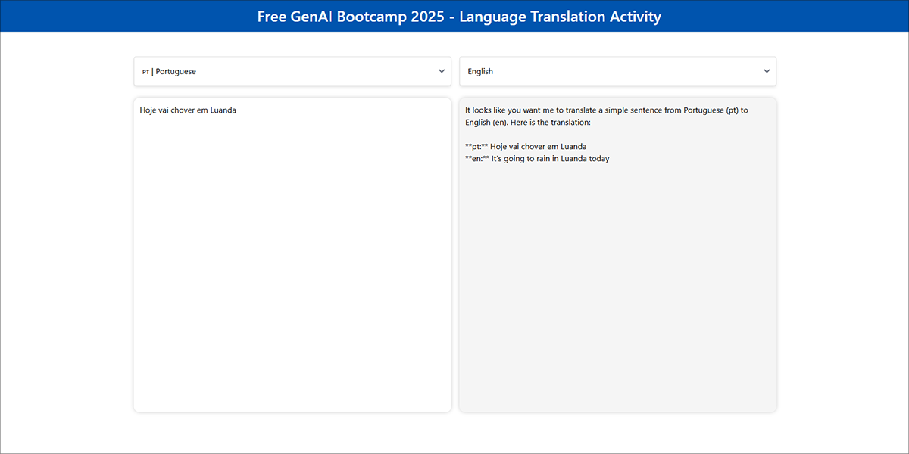

# OPEA Mega-service Implementation Guide

## Overview

This documentation provides a comprehensive guide for implementing the OPEA Translation Mega-service architecture. This microservice-based solution is designed to be integrated with the Lang-Portal platform, offering powerful translation capabilities powered by large language models.

## Architecture Components

The OPEA Mega-service consists of the following key components:

1. **Translation Python Micro-service**: Backend service handling translation operations
2. **Translation UI**: Frontend interface for user interactions
3. **LLM Service**: Large Language Model service for text processing
   - **Ollama Micro-service**: Container-based LLM runtime

### Information Flow

The flow chart below shows the interaction between different microservices:


## System Requirements

- Docker Engine 20.10+
- Docker Compose 2.20.0+
- NVIDIA GPU with CUDA support (for optimal performance)
- At least 16GB RAM
- 50GB free disk space

## Environment Setup

### 1. Clone the Repository

```bash
git clone https://github.com/VCharrua/free-genai-bootcamp-2025.git
cd free-genai-bootcamp-2025
```

### 2. Set Required Environment Variables

Create a `.env` file in the `docker_compose` directory with the following configuration:

```bash
# Network Configuration
NETW_PREFIX="10.5.0"
OPEA_NETW_SUBNET=10.5.0.0/16
OPEA_NETW_GATEWAY=10.5.0.1
LLM_HOST_IP=${NETW_PREFIX}.2
LLM_SERVICE_HOST_IP=${NETW_PREFIX}.3
MEGA_SERVICE_HOST_IP=${NETW_PREFIX}.4
FRONTEND_SERVICE_IP=${NETW_PREFIX}.5
FRONTEND_NGINX_IP=${NETW_PREFIX}.6

# LLM Configuration
LLM_COMPONENT_NAME="OpeaTextGenService"
LLM_MODEL_ID="llama3.1"
LLM_ENDPOINT_PORT="8008"
LLM_ENDPOINT_EXT_PORT="11434"
LLM_ENDPOINT="http://${LLM_HOST_IP}:${LLM_ENDPOINT_EXT_PORT}"
TGI_LLM_ENDPOINT=${LLM_ENDPOINT}
HUGGINGFACEHUB_API_TOKEN=${hf_token}

# Service Configuration
BACKEND_SERVICE_ENDPOINT="http://localhost:8888/v1/translation"
NGINX_PORT=8080
FRONTEND_SERVICE_PORT=5173
BACKEND_SERVICE_NAME=translation
BACKEND_SERVICE_IP=${MEGA_SERVICE_HOST_IP}
BACKEND_SERVICE_PORT=8888
```

## Hardware Support

This Translation service can be deployed across multiple Intel platforms:
- [Intel Gaudi2](https://www.intel.com/content/www/us/en/products/details/processors/ai-accelerators/gaudi-overview.html) 
- [Intel Xeon Scalable Processors](https://www.intel.com/content/www/us/en/products/details/processors/xeon.html)

## Building the Components

### 1. Building the LLM Text Generation Service

The Text Generation service needs to be built as a Docker container:

```bash
# Set the root directory of the OPEA Comps repository
export OPEA_COMPS_ROOT="/path-to-free-genai-bootcamp-2025/opea-comps"
cd ${OPEA_COMPS_ROOT}

# Build the container
docker build \
  --build-arg https_proxy=$https_proxy \
  --build-arg http_proxy=$http_proxy \
  -t opea/llm-textgen:latest \
  -f comps/llms/src/text-generation/Dockerfile .
```

### 2. Building the customized Translation UI Service

The Translation UI needs to be built as a Docker container:

```bash
# Set the root directory of the OPEA Comps repository
export OPEA_LANG_UI_FOLDER="/path-to-free-genai-bootcamp-2025/opea-comps/mega-service/translation/ui"
cd ${OPEA_LANG_UI_FOLDER}

docker build -t opea/translation-ui:latest --build-arg https_proxy=$https_proxy --build-arg http_proxy=$http_proxy -f docker/Dockerfile .
```

This will allow us full control over the frontend UI and customize it to our needs.

> *Note*: the same method can be applied to the nginx micro-service for customizing that component if needed.

## Deployment

### Starting the Mega-Service

Deploy all services using Docker Compose:

```bash
cd opea-comps/mega-service/translation/docker_compose
docker-compose up -d
```

This will start:
1. The Ollama server container
2. The LLM text generation service
3. The translation backend server
4. The translation UI frontend
5. The NGINX server for routing

For specific deployment information on Intel Xeon, refer to the [Xeon Guide](./translation/docker_compose/README.md).

### Verifying Deployment

Check that all containers are running:

```bash
docker-compose ps
```

Expected output should show all five containers in the "running" state.

Access the translation UI through your web browser using the nginx micro-service:

```bash
http://localhost:8080
```

## API Usage

### Translation API

The translation backend exposes endpoints for language translation:

- **Endpoint**: `http://localhost:8888/v1/translation`
- **Method**: POST
- **Headers**: 
  - Content-Type: application/json
- **Request Body**:
  ```json
  {
    "language_from": "portuguese",
    "language_to": "english",
    "source_language": "Hoje vai chover."
  }
  ```

### Validate Microservices

#### 1. Ollama Service

```bash
curl http://${host_ip}:8008/generate \
  -X POST \
  -d '{"inputs":"What is Deep Learning?","parameters":{"max_new_tokens":17, "do_sample": true}}' \
  -H 'Content-Type: application/json'
```

#### 2. LLM Microservice

```bash
curl http://${host_ip}:9000/v1/chat/completions \
  -X POST \
  -d '{"query":"Translate this from Portuguese to English:\nPortuguese: Hoje vai chover.\nEnglish:"}' \
  -H 'Content-Type: application/json'
```

#### 3. MegaService

```bash
curl http://${host_ip}:8888/v1/translation -H "Content-Type: application/json" -d '{
    "language_from": "Portuguese","language_to": "English","source_language": "Hoje vai chover."}'
```

#### 4. Nginx Service

```bash
curl http://${host_ip}:${NGINX_PORT}/v1/translation \
    -H "Content-Type: application/json" \
    -d '{"language_from": "Portuguese","language_to": "English","source_language": "Hoje vai chover."}'
```


## Running the Mega-Service Locally

Open this URL `http://{host_ip}:5173` in the browser to access the frontend with the customized UI.





## Service Management

### Checking Service Logs

View logs for a specific service:

```bash
docker-compose logs -f translation-backend-server
```

### Restarting Services

Restart a specific service:

```bash
docker-compose restart llm-ollama-server
```

### Stopping the Mega-Service

Stop all services:

```bash
docker-compose down
```

## Troubleshooting

### Network Issues

If containers cannot communicate:
- Ensure the bridge network is properly configured
- Check that the IP addresses match those in your `.env` file

```bash
docker network inspect ollama-net
```

### LLM Connection Issues

If the translation service can't connect to the LLM:
- Verify the LLM container is running: `docker ps | grep llm-ollama-server`
- Check the LLM logs: `docker logs llm-ollama-server`
- Ensure the environment variables are correctly set: `docker exec llm-ollama-server env | grep LLM_`

### Model Loading Issues

If the LLM fails to load models:
- Check the Ollama container logs: `docker logs llm-ollama-server`
- Verify the model name is correct in your `.env` file
- Ensure the `ollama-data` volume is properly mounted

## Additional Resources

For more detailed information, consult:
- [Lang-Portal Documentation](../../lang-portal/Readme.md)
- [OPEA LLMs Documentation](https://opea-project.github.io/latest/microservices/index.html#llms-microservice)
- [Ollama GitHub Repository](https://github.com/ollama/ollama)

