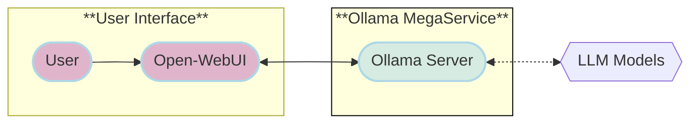
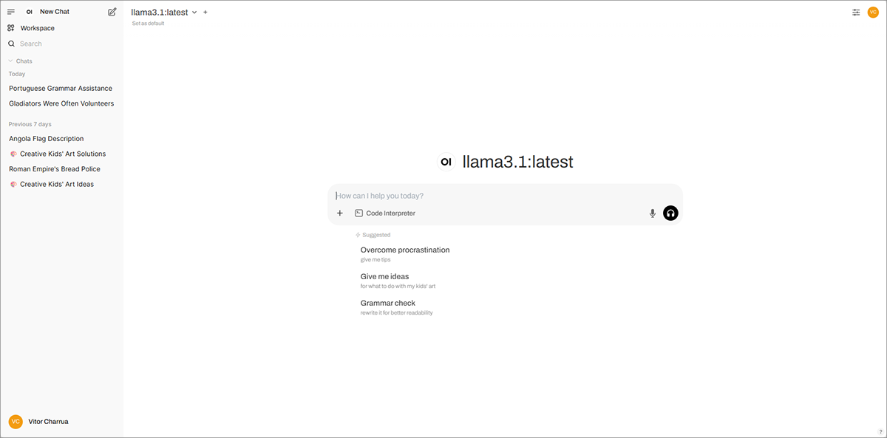
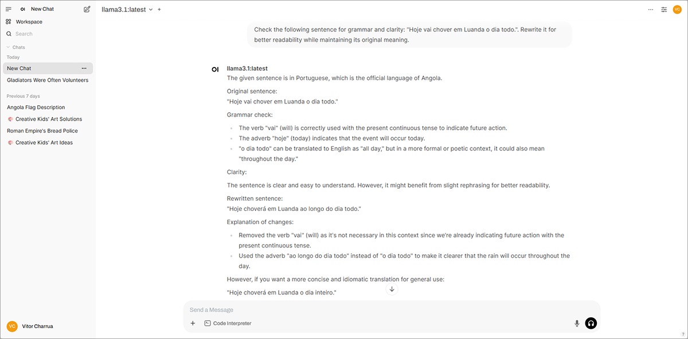

# Ollama Mega-service Implementation Guide

## Overview

This documentation provides a comprehensive guide for implementing the Ollama Mega-service architecture with Open-WebUI frontend. This solution enables you to run large language models locally using Ollama's efficient runtime, while providing a user-friendly interface through Open-WebUI.

## Architecture Components

The Ollama Mega-service consists of the following key components:

1. **Ollama Server**: Core backend service for running LLMs locally
2. **Open-WebUI**: Modern web interface for interacting with Ollama models
3. **Docker Compose**: Orchestration for all components

### Information Flow

The flow chart below shows the interaction between different components:



## System Requirements

- Docker Engine 20.10+
- Docker Compose 2.20.0+
- NVIDIA GPU with CUDA support (for optimal performance, but optional)
- At least 8GB RAM (16GB+ recommended)
- 50GB free disk space for models

## Environment Setup

### 1. Clone the Repository

```bash
git clone https://github.com/VCharrua/free-genai-bootcamp-2025.git
cd free-genai-bootcamp-2025/opea-comps/ollama
```

### 2. Set Required Environment Variables

Create a `.env` file in the `docker_compose` directory with the following configuration:

```bash
# Network Configuration
OLLAMA_NETWORK_NAME=ollama-net
OLLAMA_NETWORK_SUBNET=10.6.0.0/16
OLLAMA_NETWORK_GATEWAY=10.6.0.1
OLLAMA_SERVER_IP=10.6.0.2
OPENWEBUI_SERVER_IP=10.6.0.3

# Ollama Configuration
OLLAMA_HOST=ollama-server
OLLAMA_PORT=11434
OLLAMA_MODELS_PATH=./ollama-models

# OpenWebUI Configuration
OPENWEBUI_PORT=3000
OPENWEBUI_HOST_PORT=8080
```

## Hardware Support

This Ollama mega-service can be deployed across multiple platforms:
- Standard x86_64 systems (Intel/AMD)
- NVIDIA GPU-enabled systems
- ARM64 systems (limited model support)
- [Intel Xeon Scalable Processors](https://www.intel.com/content/www/us/en/products/details/processors/xeon.html)

## Building the Components

### 1. Pull Required Docker Images (optional)

```bash
# Pull latest Ollama image
docker pull ollama/ollama:latest

# Pull Open-WebUI image
docker pull ghcr.io/open-webui/open-webui:main
```

### 2. Create Docker Network (optional)

```bash
docker network create \
  --driver=bridge \
  --subnet=${OLLAMA_NETWORK_SUBNET} \
  --gateway=${OLLAMA_NETWORK_GATEWAY} \
  ${OLLAMA_NETWORK_NAME}
```

## Deployment

### Starting the Mega-Service

Deploy all services using Docker Compose:

```bash
cd ollama-service/deployment/docker_compose
docker compose up -d
```

This will start:
1. The Ollama server container
2. The Open-WebUI frontend

### Verifying Deployment

Check that all containers are running:

```bash
docker compose ps
```

Expected output should show all three containers in the "running" state.

Access the Open-WebUI through your web browser:

```bash
http://localhost:8080
```

## Downloading Models

To download models through the Ollama API:

```bash
# Download the Llama3 model
curl -X POST http://localhost:11434/api/pull -d '{"model":"llama3"}'

# Download the CodeLlama model
curl -X POST http://localhost:11434/api/pull -d '{"model":"codellama"}'

# Download the Llama3-Instruct model
curl -X POST http://localhost:11434/api/pull -d '{"model":"llama3:instruct"}'
```

Alternatively, models can be downloaded directly through the Open-WebUI interface.

## API Usage

### Ollama API

The Ollama server exposes endpoints for model interaction:

- **Generate Endpoint**:
  - URL: `http://localhost:11434/api/generate`
  - Method: POST
  - Request Body:
    ```json
    {
      "model": "llama3",
      "prompt": "Why is the sky blue?",
      "stream": false
    }
    ```

- **Chat Endpoint**:
  - URL: `http://localhost:11434/api/chat`
  - Method: POST
  - Request Body:
    ```json
    {
      "model": "llama3",
      "messages": [
        { "role": "user", "content": "Why is the sky blue?" }
      ]
    }
    ```

## Running the Mega-Service Locally

Open `http://localhost:3000` in your browser to access the Open-WebUI interface.

The interface allows you to:
- Chat with multiple models
- Create and manage chat sessions
- Adjust model parameters
- Upload and process documents
- View model information and statistics





## Service Management

### Checking Service Logs

View logs for a specific service:

```bash
docker compose logs -f ollama-server
```

### Restarting Services

Restart a specific service:

```bash
docker compose restart open-webui
```

### Stopping the Mega-Service

Stop all services:

```bash
docker compose down
```

## Troubleshooting

### Network Issues

If containers cannot communicate:
- Ensure the bridge network is properly configured
- Check that the IP addresses match those in your `.env` file

```bash
docker network inspect ${OLLAMA_NETWORK_NAME}
```

### Model Loading Issues

If models fail to load:
- Check the Ollama container logs: `docker logs ollama-server`
- Verify the model name is correct
- Ensure the models volume is properly mounted

### Open-WebUI Connection Issues

If Open-WebUI cannot connect to Ollama:
- Verify the Ollama server URL is correctly set in Open-WebUI settings
- Check that both containers are on the same network
- Ensure the environment variables are correctly set

## Additional Resources

For more detailed information, consult:
- [Ollama Documentation](https://github.com/ollama/ollama)
- [Open-WebUI Documentation](https://github.com/open-webui/open-webui)
- [Ollama API Reference](https://github.com/ollama/ollama/blob/main/docs/api.md)
