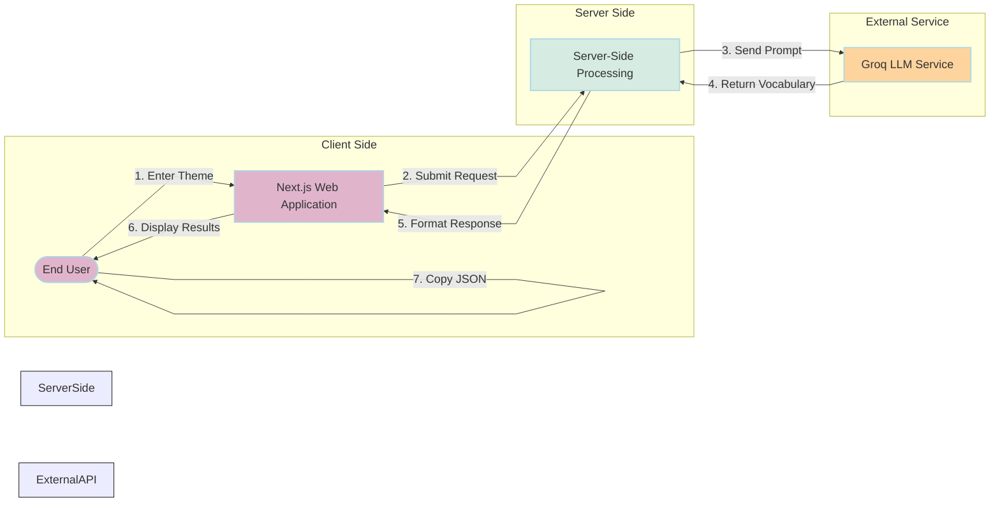

# Vocabulary Importer - Web Application

This web application serves as a thematic vocabulary generation tool for the Language Learning Portal, enabling the creation of Portuguese, Kimbundu, and English vocabulary sets. It leverages LLM technology to automatically generate structured vocabulary data based on thematic categories input by the user.

The React web application was initially built using Vercel's AI-powered development platform. Vercel (https://v0.dev) is a powerful design tool that uses AI to convert descriptions into production-ready React code with Tailwind CSS, enabling rapid prototyping and development of responsive, visually appealing interfaces with minimal manual coding.

## Objectives

- Generate vocabulary data based on thematic categories using AI
- Produce structured JSON output with Portuguese, Kimbundu, and English terms
- Provide an easy way to copy generated vocabulary data
- Integrate seamlessly with the Language Learning Portal

## Tech Stack

- **Next.js**: React framework with App Router
- **TypeScript**: Static typing for JavaScript
- **Tailwind CSS**: Utility-first CSS framework for styling
- **Groq API**: LLM provider for vocabulary generation
- **Server Actions**: For server-side API processing

## Application Flow

The vocabulary importer follows a simple three-step process:

1. **Thematic Input**: Users enter a thematic category for vocabulary generation
2. **AI Processing**: The system uses Groq LLM to generate vocabulary data in multiple languages
3. **Result Display**: Generated JSON data is displayed with a copy feature



## Main Features

### Thematic Input

- Simple text field for entering vocabulary themes (e.g., "Food", "Technology", "Weather")
- Clear submission button to trigger the generation process

### AI-Powered Generation

- Server-side processing using Groq LLM for reliable and consistent results
- Automatic structuring of vocabulary into Portuguese, Kimbundu, and English terms
- Word part analysis for language learning assistance

### Result Display

- Formatted JSON output showing the generated vocabulary
- Copy-to-clipboard functionality with user confirmation
- Easy-to-read format for reviewing before use

## API Integration

The frontend connects to a Next.js API route that interfaces with the Groq API:

1. **Next.js API Route**: Handles the LLM request on the server side
2. **Groq API**: Generates the multilingual vocabulary data

## Setup and Deployment

### Prerequisites

- Node.js 16.x or higher
- npm or yarn package manager
- Docker (optional, for containerized deployment)

### Frontend Installation

#### 1. Clone the repository:
```bash
git clone <repository-url>
cd vocabulary-importer
```

#### 2. Install dependencies:
```bash
npm install
# or
yarn
```

#### 3. Create a `.env` file:
```bash
PORT=3000
GROQ_API_KEY={your GROQ_API_KEY}
```

#### 4. Start the development server:
```bash
npm run dev
# or
yarn dev
```

The application will be available at http://localhost:3001

### Docker Deployment

You can deploy the application using Docker:

#### 1. Build the Docker image:

```bash
cd vocabulary-importer
docker build -t genai-bootcamp-2025/vocabulary-importer-webapp:latest .
```

#### 2. Run the container:

```bash
docker run -p 3001:3000 genai-bootcamp-2025/vocabulary-importer-webapp:latest
```

## Deployment with Docker

In order to deploy the application using Docker, you can user the `docker-compose.yml` file in the `deployment/docker_compose` directory.

### Deployment with image build

To be used for the first time deployment with image build for the `vocabulary-importer` services:

```bash
cd deployment/docker_compose
docker compose up --build -d
```

### Deployment without image build

```bash
cd deployment/docker_compose
docker compose up -d
```

## Usage Instructions

### 1. Entering a Thematic Category

1. Navigate to the home page and click "Start Generation"
2. Enter a thematic category in the text field (e.g., "Food", "Technology", "Weather")
3. Click "Generate" to trigger the AI processing

### 2. Viewing Results

1. Review the generated vocabulary data displayed in JSON format
2. Use the copy-to-clipboard button to copy the JSON data
3. Review the vocabulary terms in Portuguese, Kimbundu, and English

## Error Handling

- **Input Errors**: Provides clear messages for invalid or empty thematic categories
- **API Errors**: Displays appropriate messages for backend connectivity issues

## Future Improvements

- Add support for more thematic categories
- Implement AI-assisted suggestions for thematic categories
- Add a batch generation queue for multiple themes
- Create advanced customization options for vocabulary output
- Develop a word relationship mapping feature for related vocabulary
- Add user authentication and generation history tracking

## Contributing

1. Fork the repository
2. Create a feature branch
3. Make your changes
4. Run tests and ensure they pass
5. Submit a pull request
