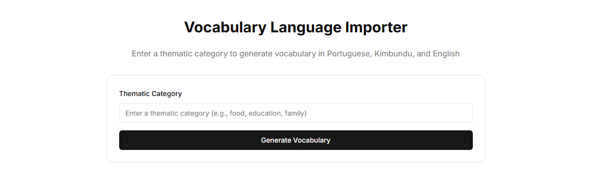

# Vocabulary Importer

A web application that allows users to generate thematic vocabulary categories for language learning using AI. This tool helps expand the Language Portal's vocabulary repository with AI-generated content.

## Overview

Vocabulary Importer serves as a companion tool to the main Language Portal platform with the following purposes:

- **AI-Powered Generation**: Create vocabulary lists using Large Language Models
- **Thematic Organization**: Generate words organized by specific themes or categories
- **Language Support**: Import vocabulary for Portuguese, Kimbundu, and English
- **Seamless Integration**: Export generated content to the main Language Portal

## Tech Stack

- **Next.js**: React framework for the web application
- **TypeScript**: Static typing for JavaScript
- **Groq API**: LLM integration for vocabulary generation
- **Tailwind CSS**: Utility-first CSS framework
- **ShadCN UI**: Component library for the user interface
- **Vercel**: Deployment platform

## File Structure

```
vocabulary-importer/
├── app/                           # Application code
│   ├── api/                       # API routes
│   │   └── generate-vocabulary/   # Vocabulary generation endpoint
│   │       └── route.ts           # API handler for vocabulary generation
│   ├── page.tsx                   # Main application page
│   ├── layout.tsx                 # Root layout component
│   └── globals.css                # Global styles
├── components/                    # UI components
│   ├── theme-provider.tsx         # Theme switching component
│   ├── vocabulary-importer.tsx    # Combined form and results component
│   └── ui/                        # ShadCN UI components
├── lib/                           # Utility functions
│   └── utils.ts                   # Helper functions
├── public/                        # Static assets
├── .env.local                     # Local environment variables (not in repo)
├── components.json                # ShadCN UI configuration
├── next.config.js                 # Next.js configuration
├── package.json                   # Project dependencies
├── tailwind.config.ts             # Tailwind configuration
└── tsconfig.json                  # TypeScript configuration
```

## API Integration

The application integrates with the Groq API to generate vocabulary lists. The API key is stored as an environment variable:

```
GROQ_API_KEY=your_api_key_here
```

## Features

- **Theme Selection**: Choose a vocabulary theme to generate (e.g., "Kitchen Items", "Professions")
- **Language Options**: Generate vocabulary in Portuguese, Kimbundu, and English
- **Customizable Size**: Select the number of vocabulary items to generate
- **Preview & Edit**: Review and modify generated content before importing
- **Export Options**: Download as JSON or directly import to Language Portal

## Setup and Deployment

### Prerequisites

- Node.js 16+
- npm or yarn
- Groq API key

### Installation

#### 1. Clone the repository:
```bash
git clone <repository-url>
cd lang-portal/vocabulary-importer
```

#### 2. Install dependencies:
```bash
npm install
# or
yarn
```

#### 3. Create a `.env.local` file:
```bash
GROQ_API_KEY=your_groq_api_key
```

#### 4. Start the development server:
```bash
npm run dev
# or
yarn dev
```

The application will be available at http://localhost:3001.





### Deploying to Vercel

1. Push your code to a GitHub repository
2. Connect the repository to Vercel
3. Configure environment variables in the Vercel dashboard
4. Deploy

## Usage

1. Open the application in your browser
2. Enter a thematic category (e.g., "Sports Equipment", "Musical Instruments")
3. Choose the number of vocabulary items to generate
4. Click "Generate Vocabulary"
5. Review the generated content
6. Download as JSON or import directly to Language Portal

## Integration with Language Portal

This tool complements the main Language Portal platform by providing an easy way to expand the vocabulary database. Generated content follows the same data structure used by the main application:

```json
[
  {
    "portuguese": "água",
    "kimbundu": "maza",
    "english": "water",
    "parts": [{"portuguese": "ág","kimbundu": ["ma"],"english": "water"}] 
  },
  {
    "portuguese": "escola",
    "kimbundu": "xikola",
    "english": "school",
    "parts": [{"portuguese": "escol","kimbundu": ["xikol"],"english": "learn"}]
  },
  // Additional vocabulary items...
]
```

## Future Improvements

- Add support for additional languages
- Improve error handling for edge cases
- Implement batch processing for large vocabulary sets
- Add vocabulary validation and quality checks
- Enhance the user interface with more feedback during generation
